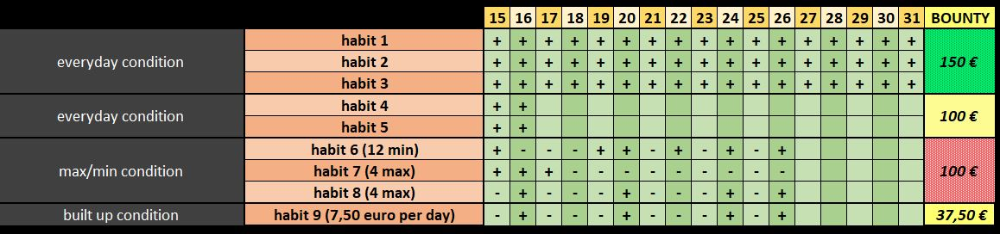

# habit-tracker

Inspired by Atomic Habits - creating a tool to create and track habits.

## Summary

A bounty/quest system in which habits can be tracked and rewarded. Its purpose is to build a sense of progress, a sense of reward, and a proper relationship with money (spending money remaining after paying for necessities by doing a worthwhile action in return).

## Different Habit Conditions

The currently planned conditions:

- everyday condition - needs to be done everyday or the bounty is denied
- max/min condition - needs to be done up to a max of X times or at least min X times to be legible for bounty
- day build up condition - every day of the month adds $(bounty/days in the month) to the month bounty, skipping days does not cancel it just doesn't add to it

## Technologies

- HTML - for basic structure and information display
- PHP - connecting habit information to a database
- XAMPP/SQL - for having and using the local database
- Javascript - dynamic events (secondary)
- CSS - styling (secondary)

## References

A version of the idea in Excel represents the basic structure:

